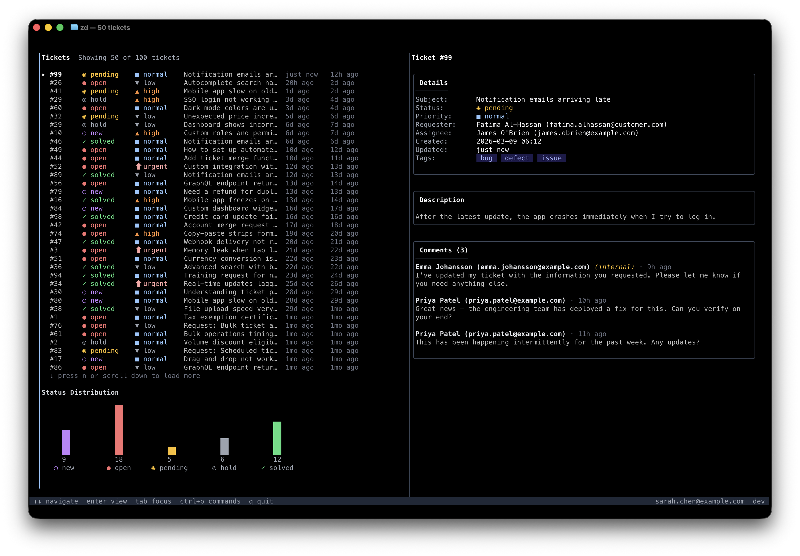

# Zendesk CLI (`zd`)

[](https://github.com/johanviberg/zd/releases/latest)
[](https://github.com/johanviberg/zd/actions/workflows/release.yml)
[](https://goreportcard.com/report/github.com/johanviberg/zd)
[](https://pkg.go.dev/github.com/johanviberg/zd)
[](LICENSE)

An unofficial, agent-friendly command-line interface for Zendesk's ticketing REST API. Built for both humans and AI agents.




## What it does

`zd` lets you manage Zendesk tickets from the terminal. List, search, create, update, and delete tickets with structured output that works well in scripts and AI agent workflows. It includes built-in discovery commands (`zd commands` and `zd schema`) that let AI agents introspect the CLI at runtime, so they can figure out what's available without hardcoded knowledge.

## Installation

### Homebrew

```bash
brew install johanviberg/tap/zd
```

### go install

```bash
go install github.com/johanviberg/zd@latest
```

### Linux (deb)

Download the `.deb` package from the [latest release](https://github.com/johanviberg/zd/releases/latest):

```bash
sudo dpkg -i zd_*_linux_amd64.deb
```

### Linux (rpm)

Download the `.rpm` package from the [latest release](https://github.com/johanviberg/zd/releases/latest):

```bash
sudo rpm -i zd_*_linux_amd64.rpm
```

### Build from source

```bash
git clone https://github.com/johanviberg/zd.git
cd zd
go build -o zd
```

## Authentication

Choose **one** of the methods below. Do not mix methods — `zd` uses the first credentials it finds (environment variables take priority over stored credentials).

### OAuth (recommended)

OAuth is the recommended authentication method. It uses a browser-based consent flow, avoids putting secrets on the command line, and the resulting token is scoped to only the permissions you grant.

#### 1. Register an OAuth client in Zendesk

1. In Admin Center, go to **Apps and integrations → APIs → OAuth clients**, then click **Add OAuth client**.
2. Fill in the fields:
   - **Name** — e.g. `zd CLI` (shown to users on the consent screen)
   - **Description** — optional
   - **Client kind** — select **Confidential** (the CLI runs locally and stores the secret with restricted file permissions)
   - **Redirect URLs** — enter `http://127.0.0.1/callback` (the CLI starts a local server on a random port; Zendesk matches on host and path, ignoring the port for localhost)
3. Click **Save**. A **Secret** field appears — copy it immediately, it is only shown in full once.
4. Note the **Identifier** field — this is the Client ID.

#### 2. Log in

```bash
zd auth login \
  --subdomain mycompany \
  --client-id YOUR_CLIENT_ID \
  --client-secret YOUR_CLIENT_SECRET
```

This opens a browser window for the OAuth consent flow. The CLI requests `read write` scopes. The token is stored locally.

### API token

If you can't use OAuth (e.g. in headless environments or CI), you can authenticate with an API token instead:

```bash
zd auth login --method token \
  --subdomain mycompany \
  --email you@example.com \
  --api-token YOUR_API_TOKEN
```

### Environment variables

As an alternative to `auth login`, you can set environment variables. This is useful for CI/CD or scripts. Environment variables always take priority over stored credentials.

```bash
# OAuth token
export ZENDESK_SUBDOMAIN=mycompany
export ZENDESK_OAUTH_TOKEN=your_oauth_token

# Or API token
export ZENDESK_SUBDOMAIN=mycompany
export ZENDESK_EMAIL=you@example.com
export ZENDESK_API_TOKEN=your_token
```

### Check auth status

```bash
zd auth status
```

## Quick start

```bash
# List recent tickets
zd tickets list

# Show a specific ticket
zd tickets show 12345

# Create a ticket
zd tickets create --subject "Printer broken" --comment "The office printer is not responding"

# Update a ticket
zd tickets update 12345 --status pending --comment "Waiting on vendor" --public=false

# Search tickets
zd tickets search "status:open priority:high"

# Delete a ticket (requires confirmation)
zd tickets delete 12345 --yes
```

### Natural language search

`zd tickets search` accepts natural language queries, which are locally translated to Zendesk search syntax (no API key needed). Queries already in Zendesk syntax pass through unchanged.

```bash
zd tickets search "urgent tickets assigned to jane"
zd tickets search "open tickets created this week"
```

### Demo mode

The `--demo` flag lets you explore `zd` without authentication. It generates 100+ synthetic tickets locally.

```bash
zd tui --demo
zd tickets list --demo
zd tickets show 42 --demo
```

Works with `tickets list`, `tickets show`, `tickets search`, `tickets comments`, and `tui`.

## Interactive TUI

`zd` includes an optional interactive terminal UI for browsing and managing tickets. Launch it with:

```bash
zd tui
```

The TUI provides:

- **Split-panel layout** — default side-by-side view with ticket list on the left and detail on the right; auto-collapses to single panel on narrow terminals (<80 cols)
- **Ticket list** — browse tickets with `j`/`k` or arrow keys, color-coded status and priority
- **Panel control** — press `tab` to switch focus between panels, `v` to toggle the detail panel
- **Infinite scroll** — auto-loads the next page when reaching the bottom of the list; or press `n`
- **Detail view** — press `enter` to view a ticket's details, description, and comments (scroll with arrows)
- **Search** — press `/` to search using Zendesk search syntax or natural language (e.g. `status:open priority:high`), `esc` to clear
- **Comment** — press `c` to add a comment, toggle between public reply and internal note with `tab`, add CC recipients with `ctrl+a`, submit with `ctrl+s`
- **Status/Priority** — press `s` or `p` to change status or priority via a picker
- **Auto-refresh** — press `r` to toggle auto-refresh (polls every 5 min with countdown), `R` for an immediate refresh; new tickets are highlighted with a star and a terminal bell sounds
- **Kanban board** — press `w` to toggle a kanban view that groups tickets by status into columns; navigate with arrow keys or `h`/`j`/`k`/`l`
- **Status chart** — press `b` to toggle a vertical bar chart showing ticket status distribution, color-coded to match status labels
- **Dynamic window title** — terminal tab title updates to reflect current context (ticket count, search query, or ticket detail)
- **My tickets** — press `m` to toggle a filter showing only tickets assigned to you; press `m` again or `esc` to clear
- **Go to ticket** — press `g` to jump directly to a ticket by ID
- **Image attachments** — press `i` in detail view to browse image attachments across comments and open them in your default app (e.g. Preview on macOS)
- **Open in browser** — press `o` to open the selected ticket in your default browser
- **Status bar** — shows the authenticated user in the bottom bar
- **Navigation** — `esc` to go back, `q` to quit

The TUI uses the same authentication and service layer as the CLI commands — no additional setup required.

## Output formats

Use `--output` (or `-o`) to control how results are formatted:

```bash
# Human-readable table (default)
zd tickets list

# JSON
zd tickets list -o json

# Newline-delimited JSON (one object per line, good for piping)
zd tickets list -o ndjson
```

### Field projection

Use `--fields` to select specific fields:

```bash
zd tickets list --fields id,status,subject -o json
```

### Sideloading related records

Use `--include` to sideload related data (e.g. users) alongside tickets. This resolves IDs like `requester_id` and `assignee_id` into human-readable names and emails:

```bash
# Show a ticket with requester and assignee names
zd tickets show 12345 --include users

# List tickets with user names in the table
zd tickets list --include users

# Combine with field projection
zd tickets show 12345 --include users --fields id,subject,requester_name,assignee_name
```

When users are sideloaded, the output is enriched with `requester_name`, `requester_email`, `assignee_name`, and `assignee_email` fields.

Errors always go to stderr. When using `--output json`, errors are also structured JSON on stderr.

## Using with AI agents

`zd` is designed to be used by AI agents like Claude Code, Claude Desktop, Cursor, and Windsurf.

### MCP server (recommended)

`zd` includes a built-in [Model Context Protocol](https://modelcontextprotocol.io) server that exposes Zendesk operations as tools. No wrapper scripts or extra dependencies — it ships in the same binary.

#### Claude Code

```bash
claude mcp add zendesk -- zd mcp serve
```

#### Claude Desktop

Add to `~/Library/Application Support/Claude/claude_desktop_config.json`:

```json
{
  "mcpServers": {
    "zendesk": {
      "command": "zd",
      "args": ["mcp", "serve"]
    }
  }
}
```

#### Cursor / Windsurf

Point at `zd mcp serve` in your editor's MCP settings. The server communicates over stdio.

#### Available tools

| Tool | Description |
|---|---|
| `zendesk_list_tickets` | List tickets sorted by update time, with optional status/assignee/group filters |
| `zendesk_show_ticket` | Show full ticket details with requester and assignee info |
| `zendesk_search_tickets` | Search using Zendesk query syntax |
| `zendesk_create_ticket` | Create a ticket with subject, body, priority, and tags |
| `zendesk_update_ticket` | Update a ticket: add comments (public or internal), change status/priority, manage tags, add CCs |
| `zendesk_delete_ticket` | Permanently delete a ticket |

The MCP server uses the same authentication as the CLI — run `zd auth login` first. Demo mode works too: `zd mcp serve --demo`.

### Agent skill

`zd` also ships with an [agent skill](https://skills.sh/) for agents that prefer calling CLI commands directly. Install it with the [skills CLI](https://github.com/vercel-labs/skills):

```bash
npx skills add johanviberg/zd
```

This copies the skill into your agent's skills directory (e.g. `.claude/skills/` for Claude Code). Once installed, the agent can use `zd` without any additional setup in your project files.

### Self-describing commands

Two built-in commands make `zd` discoverable at runtime, even without the skill or MCP server:

#### Command discovery

`zd commands` lists every available command with its flags, types, defaults, and argument names:

```bash
zd commands -o json
```

An agent can call this once to learn the full CLI surface.

#### JSON Schema for tool calling

`zd schema` generates a JSON Schema for any command's input, which maps directly to tool-calling conventions:

```bash
zd schema --command "tickets create"
```

This returns a schema with property types, required fields, and defaults that an agent can use to construct valid calls.

## Command reference

| Command | Description |
|---|---|
| `zd auth login` | Authenticate with Zendesk (OAuth or API token) |
| `zd auth logout` | Remove stored credentials |
| `zd auth status` | Show current authentication status |
| `zd tickets list` | List tickets (supports `--include`) |
| `zd tickets show <id>` | Show a ticket (supports `--include`) |
| `zd tickets create` | Create a ticket |
| `zd tickets update <id>` | Update a ticket (comment, status, priority, tags, CCs) |
| `zd tickets delete <id>` | Delete a ticket |
| `zd tickets search <query>` | Search tickets (supports `--include` and natural language) |
| `zd tickets comments <id>` | List comments on a ticket (supports `--include`) |
| `zd articles list` | List Help Center articles |
| `zd articles show <id>` | Show a Help Center article |
| `zd articles search <query>` | Search Help Center articles |
| `zd mcp serve` | Start MCP server on stdio for AI agent integration |
| `zd completion` | Generate shell autocompletion (bash, fish, powershell, zsh) |
| `zd tui` | Interactive terminal UI for managing tickets |
| `zd config show` | Show current configuration |
| `zd config set <key> <value>` | Set a configuration value |
| `zd commands` | List all commands with flags (for agent discovery) |
| `zd schema --command "..."` | JSON Schema for a command's input |
| `zd version` | Print version information |

### Global flags

| Flag | Description |
|---|---|
| `-o, --output` | Output format: `text`, `json`, `ndjson` (default: `text`) |
| `--fields` | Field projection (comma-separated) |
| `--no-headers` | Omit table headers in text mode |
| `--non-interactive` | Never prompt for input |
| `--yes` | Auto-confirm prompts |
| `--subdomain` | Override Zendesk subdomain |
| `--profile` | Config profile (default: `default`) |
| `--demo` | Use synthetic demo data (no auth required) |
| `--trace-id` | Trace ID attached to API requests |

## Configuration

Config files live in `$XDG_CONFIG_HOME/zd/` (typically `~/.config/zd/`):

- `config.yaml` -- settings per profile
- `credentials.json` -- stored auth tokens (file permissions: 0600)

### Profiles

You can maintain multiple Zendesk accounts using profiles:

```bash
# Login to a second account
zd auth login --profile staging --subdomain mycompany-staging --method token \
  --email you@example.com --api-token STAGING_TOKEN

# Use it
zd tickets list --profile staging
```

### Setting config values

```bash
zd config set subdomain mycompany
zd config show
```

## Exit codes

| Code | Meaning |
|---|---|
| 0 | Success |
| 1 | General error |
| 2 | Argument error |
| 3 | Authentication error |
| 4 | Retryable error (rate limited) |
| 5 | Not found |

## License

MIT
